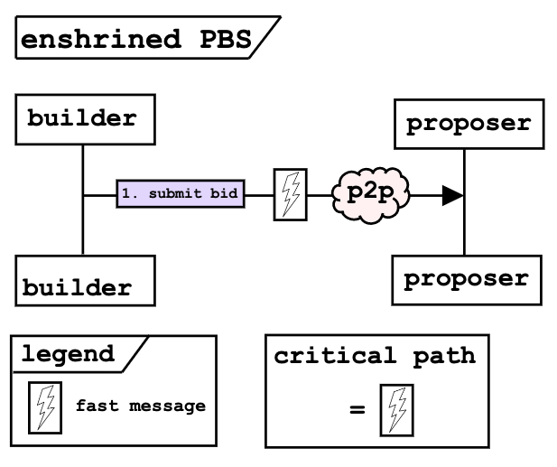

# Towards enshrined PBS — an optimistic roadmap

_"This has been a latency awakening" - Justin Drake (march 1, 2023)_

## Purpose
Present a roadmap towards enshrined PBS (ePBS) through a series of modifications
to the existing `mev-boost` [relay](https://github.com/flashbots/mev-boost-relay) 
functionality. By progressively removing the relay responsibilities and pruning the 
critical path of the block building pipeline,
we aim to converge to a system that looks quite similar to [existing](https://ethresear.ch/t/two-slot-proposer-builder-separation/10980) [proposals](https://ethresear.ch/t/single-slot-pbs-using-attesters-as-distributed-availability-oracle/11877) for ePBS.

### Rationale
1. **Agility** — We aim to approach this protocol upgrade as suggested by Justin in the [Censorship Panel](https://www.youtube.com/watch?v=Z9VCdiSPJEQ&t=2729s) at SBC. To front-load the 
R&D effort, we can iterate quickly by experimenting with a portion of existing 
relays, builders, and validators to reduce uncertainty and risk around full ePBS.
There are tradeoffs between ePBS and `mev-boost` as highlighted by Barnabé at [Devconnect](https://youtu.be/jQjBNbEv9Mg?t=943) and in [Notes on PBS](https://barnabe.substack.com/i/82304191/market-structure-and-allocation-mechanism). Through this roadmap we explore the 
design space between the two ends of the spectrum, without fully committing upfront to ePBS.
2. **Inevitability** — At [Devconnect](https://www.youtube.com/watch?v=OD54WfVuDWw&t=818s), Vitalik noted that with Danksharding, some builder separation becomes mandatory because bandwidth
requirements for large (32 MB) blocks exceed what is within reach of a home-staker. This roadmap
allows us to progress the research discussion by examining how different mechanisms work in practice.
3. **Accessibility** — By presenting relay data and designing the optimistic architecture in the open, we increase visibility into the
existing block building market. This helps answer research questions (e.g., 
[ROP-0](https://efdn.notion.site/ROP-0-Timing-games-in-Proof-of-Stake-385f0f6279374a90b52bf380ed76a85b) from Barnabé and Caspar) and allows 
independent relays stay competitive with vertically integrated Builder-Relays. 
Additionally, optimistic relaying actually reduces the hardware and networking
[resources](https://collective.flashbots.net/t/ideas-for-incentivizing-relays/586) required for a relay to be competitive, lowering the barrier of entry. 

We define the "critical path" as the set of operations and messages that compose 
the block production pipeline beginning when the builder constructs a block. 
We present a progression of 3 relay modifications that each reduce the latency associated
with the critical path. 

> Latency is a centralizing force in the competitive block building market. Since 
MEV is constantly being produced, rationale
builders are incentivized to colocate with relays, form trusted connections to relays, or even run
their own relay infrastructure in order to minimize (down to $\mu s$ or $ns$) the time between when they build a block
and when that header is part of the auction. We believe that by removing as much 
much latency as possible from the pipeline, we can maintain a competitive and open builder ecosystem, while working to phase out relays all together. 

## Block production today
The figure below schematizes the critical path under the existing `mev-boost`
architecture. 
<table><tr><td>

1. The builder submits a bid that contains the full execution body 
of the block to the relay.
2. The relay simulates the block; the simulation must complete before the bid can win the auction.
3. The proposer sends the signed header back to the relay and the relay publishes the full block.
</td></tr></table>

#### What is the critical path?
<!-- The relay has a number of tasks to perform:
- storing the builder header and execution body,
- validating the block using an execution node,
- validating the proposer payment is present, and
- publishing the winning block\*. -->

The critical path runs through the relay, which is tasked with
- receiving the full block over the network from the builder (this can be up to several MB worth of data),
- validating the block against an execution node internally and communicating the winning header to the proposer, and
- receiving the signed header from the proposer and publishing\* the block.

In practice, this entire process can take hundreds of milliseconds, even when running on
high-performance hardware with good network connectivity.

> \* Note that the winning block is returned to the proposer,
so even if the relay doesn't publish the block, the proposer should and is incentivized to do so.

## Optimistic Relay v1 — "Asynchronous block validation"
The figure below denotes the critical path under Optimistic Relaying v1. 
This idea is [proposed](https://github.com/michaelneuder/opt-relay-docs/blob/main/proposal.md) and [implemented](https://github.com/flashbots/mev-boost-relay/pull/285); it 
was also discussed in the [MEV community call #0](https://collective.flashbots.net/t/mev-boost-community-call-0-23-feb-2023/1348).

<table><tr><td>

1. The builder submits a bid that contains the full execution body 
of the block to the relay.
2. The relay immediately marks the bid as eligible to win the auction.
3. The proposer sends the signed header back to the relay and the relay publishes the full block.
</td></tr></table>

#### What is the critical path?
This flow differs only slightly from the previous; the relay does not immediately 
validate the block sent from the builder. This results in a reduction of
the latency between when a builder submits a bid to the relay and when that bid
becomes eligible to win the auction. This benefits both the builders and 
the proposers because it allows bids to arrive later in the slot, thus capturing more 
MEV for both parties. Under this design, builders can dishonestly submit high bids for invalid blocks
that end up winning the auction, which results in a missed slot (because the proposer
signed an invalid header). We account for this by requiring builders to post collateral to
the relay which will be used to refund proposers if a slot is missed. See the [proposal](https://github.com/michaelneuder/opt-relay-docs/blob/main/proposal.md), [implementation](https://github.com/flashbots/mev-boost-relay/pull/285), and [community call](https://collective.flashbots.net/t/mev-boost-community-call-0-23-feb-2023/1348) for further details. 
This proposal should lower the hardware and networking requirements of running a relay because now there is no need for large amounts of burst compute and bandwidth right at the end of the slot.

Beyond the practical benefits mentioned above, we modified the critical path. Now, the relay is responsible for

- receiving the full block over the network from the builder (this can be up to several MB worth of data),
- communicating the winning header to the proposer, and
- receiving the signed header from the proposer and publishing the block.

This demonstrates the main objective of this roadmap — "to reduce the duties of the relay 
and the latency of the critical path". 

## Optimistic Relay v2 —"Header-only parsing"
The figure below demonstrates the critical path under Optimistic Relaying v2.

<table><tr><td>

1. The builder submits a bid to the relay.
2. The relay parses the incoming message just for the bid details and then marks the bid as eligible to win the auction.
3. The proposer sends the signed header back to the relay and the relay publishes the full block.
</td></tr></table>

#### What is the critical path?
The critical path still runs through the relay, which is tasked with
- parsing the incoming message from the builder for just the bid details (this is a few hundred bytes),
- communicating the winning header to the proposer, and
- receiving the signed header from the proposer and publishing\* the block.

Here we remove additional latency of waiting for the whole block execution body to 
download to the relay (which will become even more relevant with full Danksharding). 
This can result in an invalid or missing block from the builder, 
in which case the proposer refund is handled in the same manner as v1. 

> This design has an additional practical benefit. The relay is no longer able to censor. 
The relay marks the bid as eligible when the header is parsed, and thus doesn't yet have information about the transactions in the execution body. 

## Optimistic Relay v3 — "Relay as an oracle"
The figure below demonstrates the block lifecycle under Optimistic Relaying v3.

<table><tr><td>

1. The builder submits a header-only bid to the mempool. 
2. The proposer sends the signed header back to mempool and the builder publishes the full block.
</td></tr></table>

#### What is the critical path?
Note that now the critical path no longer interacts with the relay at all! The builders 
and proposers communicate directly through the p2p layer. We assume that the builders will be well-connected nodes in the p2p network because they are incentivized to have extremely short 
paths to the proposers, thus the messages will still be fast. 

The critical path is now just
- the proposer listening over the p2p network for header-only bids (this is a few hundred bytes), and
- the builder listening over the p2p network for a signed header corresponding to their bid.

The relay is still present in this architecture, but only serves as an oracle 
in the case of a missed slot. The relay observes the mempool and determines if 
(a) a signed header was produced on time, but (b) the corresponding signed block was not produced on time. In this situation, the builder is at fault, and their collateral is again used to refund
the proposer as in v1 \& v2. 

> Note that the proposer payments could be implemented in an unconditional way. Such a mechanism was [presented](https://github.com/flashbots/mev-boost/issues/109)
by Alex O. and Stephane. This would reduce the trust assumptions to zero. The tradeoff here
is the engineering complexity and inherent risk of using smart contracts to implement this logic.
This may well be worth investing time into in the future, but we estimate that in the short-term, the 
relay operators (or [guarantors](https://github.com/michaelneuder/opt-relay-docs/blob/main/proposal.md#relay-collateralization)) should handle the refunds manually.

## ePBS — "Replace the relay with a committee"
The figure below demonstrates the block lifecycle under ePBS.

<table><tr><td>

1. The builder submits a header-only bid to the mempool. 
</td></tr></table>

The final evolution of this roadmap is to replace the v3 relay with a committee of 
validators and enshrine PBS into the protocol. The specifics of the mechanism
can vary; Vitalik has proposed [single-slot](https://ethresear.ch/t/single-slot-pbs-using-attesters-as-distributed-availability-oracle/11877) and 
[two-slot](https://ethresear.ch/t/two-slot-proposer-builder-separation/10980). 
Under the two-slot implementation (which seems to be the most popular currently),
the proposer chooses a header to include in their beacon block and publishes it in their slot. 
One committee attests to this block and once a builder is confident that the block
will not be reorged, they publish an intermediate block in the subsequent slot that contains the full execution payload. The remaining committees attest to this intermediate block. The enforcement
of honest behavior is implemented into the fork choice rule, so that if a builder produces a 
block that differs from the winning header, the committee members simply do not attest to it. 

Note how the first committee attests 
to the timely publication of a signed header and the remaining committees attest to the timely publication of a signed block, which is exactly the role that the 
relay plays in v3.

