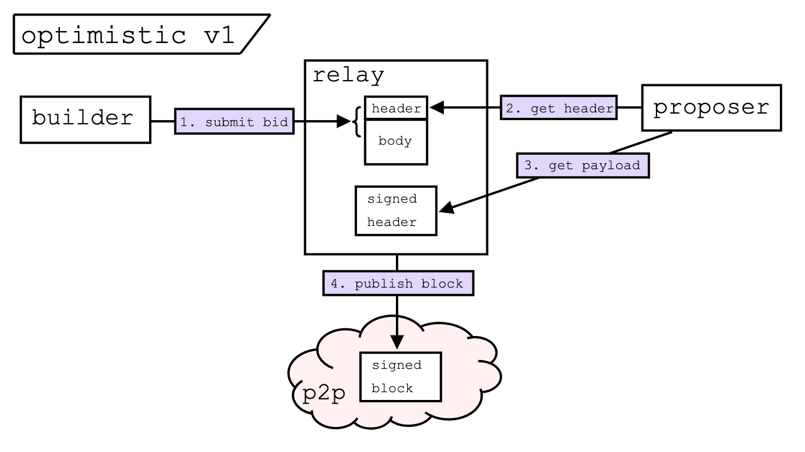
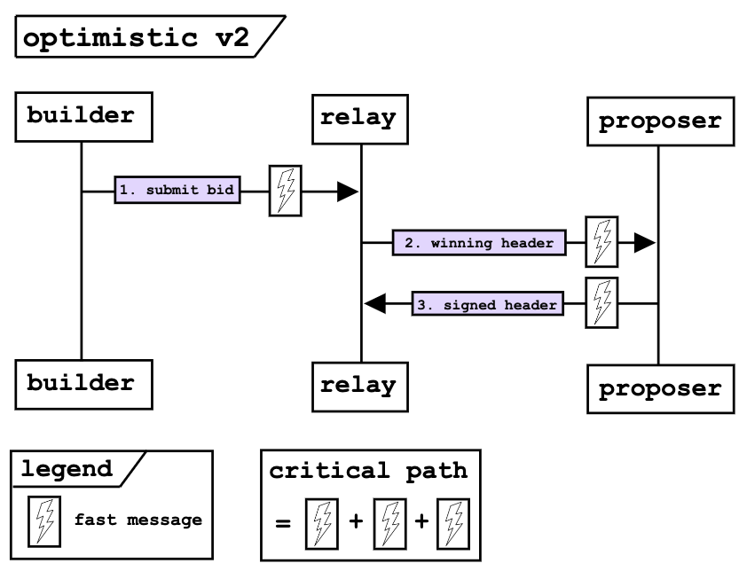
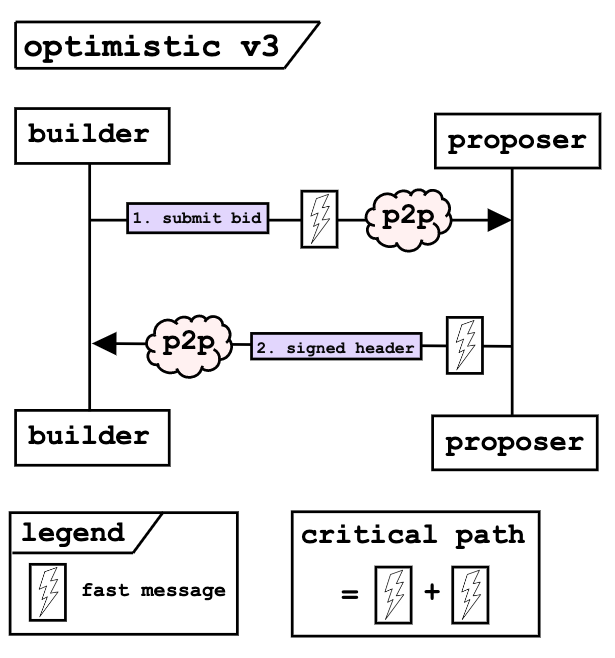

# Towards Enshrined PBS — An Optimistic Roadmap

## Purpose
Present a roadmap towards Enshrined PBS (ePBS) through a series of modifications
to the existing `mev-boost` [relay](https://github.com/flashbots/mev-boost-relay) 
functionality. By progressively removing the relay responsibilities,
we aim to converge to a system that looks quite similar to [existing](https://ethresear.ch/t/two-slot-proposer-builder-separation/10980) [proposals](https://ethresear.ch/t/single-slot-pbs-using-attesters-as-distributed-availability-oracle/11877) for ePBS.

### Rationale
1. **Agility** — Approach the protocol upgrade as suggested by Justin in the [Censorship Panel](https://www.youtube.com/watch?v=Z9VCdiSPJEQ&t=2729s) at SBC 2022. To front-load the 
R&D effort, we can iterate quickly by experimenting with a portion of existing 
relays, builders, and validators to reduce uncertainty and risk around full ePBS.
There are tradeoffs between ePBS and `mev-boost` as highlighted by Barnabé at [Devconnect 2022](https://youtu.be/jQjBNbEv9Mg?t=943) and in [Notes on PBS](https://barnabe.substack.com/i/82304191/market-structure-and-allocation-mechanism). Through this roadmap we explore the 
design space between the two ends of the spectrum.
2. **Inevitability** — At [Devconnect 2022](https://www.youtube.com/watch?v=OD54WfVuDWw&t=818s), Vitalik noted that with Danksharding, some separation becomes mandatory because bandwidth
requirements for large blocks exceed what is within reach of a home-staker. This roadmap
allows us to progress the research discussion by implementing (with feedback from the community)
changes to the existing `mev-boost` architecture to see how they function in practice. 
This increases our understanding of how the block building market could behave in ePBS.
3. **Accessibility** — By presenting relay data and designing the optimistic architecture in the open, we increase visibility into the
existing block building market. This helps answer research questions (e.g., 
[ROP-0](https://efdn.notion.site/ROP-0-Timing-games-in-Proof-of-Stake-385f0f6279374a90b52bf380ed76a85b)) and allows 
independent relays stay competitive with vertically integrated Builder-Relays. 
Additionally, optimistic relaying actually reduces the hardware and networking
[resources](https://collective.flashbots.net/t/ideas-for-incentivizing-relays/586) required for a current relay to be competitive, lowering the barrier of entry. 

## Block lifecycle
The figure below schematizes the lifecycle of a block in the existing `mev-boost`
architecture.
<table><tr><td>

1. The builder submits a bid to the relay, which contains a header and an execution 
body.
2. The relay validates the block and asserts that it includes an appropriate payment
to the proposer.
3. The proposer calls `getHeader` to receive the highest paying bid.
4. The proposer signs the header and calls `getPayload` which delivers the signed header
to the relay.
5. The relay publishes the signed block to the p2p network.
</td></tr></table>

#### What is the relay doing?
As implemented, the relay aims to be a simple, mutually-trusted, neutral third-party to
connect builders and proposers. The relay duties and the corresponding trust assumptions are

1. Storing the builder header and execution body $\implies$ *Trust assumption 1: the builder trusts relay not to steal their MEV.*
2. Validating the body $\implies$ *Trust assumption 2: the proposer trusts the relay
to provide a valid header to sign.*
3. Validating the payment $\implies$ *Trust assumption 3: the proposer trusts the relay
to check that the block that pays them.*
4. Publishing the winning block $\implies$ *Trust assumption 4: the builder trusts the relay to publish the winning block.\** 

> \* Note that the winning block is returned to the proposer,
so even if the relay doesn't publish the block, the proposer should and is incentivized to do so. We still list it as a trust assumption because the builder doesn't trust the proposer,
so in essence they still trust that the relay publishes their block if it wins the auction.

## Optimistic Relay v1 — "Efficient builder submissions"
The figure below demonstrates the block lifecycle under Optimistic Relaying v1. 
This idea is [proposed](https://github.com/michaelneuder/opt-relay-docs/blob/main/proposal.md) and [implemented](https://github.com/flashbots/mev-boost-relay/pull/285); it 
was also discussed in the [MEV community call #0](https://collective.flashbots.net/t/mev-boost-community-call-0-23-feb-2023/1348).

<table><tr><td>

1. The builder submits a bid to the relay, which contains a header and an execution 
body.
2. The proposer calls `getHeader` to receive the highest paying bid.
3. The proposer signs the header and calls `getPayload` which delivers the signed header
to the relay.
4. The relay publishes the signed block to the p2p network.
</td></tr></table>

#### What is the relay doing?
This flow differs only slightly from the previous; the relay does not immediately 
validate the block sent from the builder. This results in a reduction of
the latency between when a builder submits a bid to the relay and when that bid
becomes eligible to win the auction. This benefits both the builders and 
the proposers because it allows bids to arrive later in the slot, thus capturing more 
MEV for both parties. Under this design, builders can submit high bids for invalid blocks
that end up winning the auction, which results in a missed slot (because the proposer
signed an invalid header). We account for this by requiring builders to post collateral to
the relay which will be used to refund proposers if a slot is missed. See the [proposal](https://github.com/michaelneuder/opt-relay-docs/blob/main/proposal.md), [implementation](https://github.com/flashbots/mev-boost-relay/pull/285), and [community call](https://collective.flashbots.net/t/mev-boost-community-call-0-23-feb-2023/1348) for further details. 
Further, this proposal should lower the hardware and networking requirements of running a relay because now there is no need for large amounts of burst compute and bandwidth
at the end of the slot because the block simulation is handled asynchronously in the next slot.

Beyond the practical benefits mentioned above, we also modified the relay duties and trust assumptions. Now, the relay is responsible for

1. Storing the builder header and execution body $\implies$ *Trust assumption 1: the builder trusts relay not to steal their MEV.*
2. ~~Validating the body $\implies$ *Trust assumption 2: the proposer trusts the relay
to provide a valid header to sign.*~~
3. ~~Validating the payment $\implies$ *Trust assumption 3: the proposer trusts the relay
to check that the block that pays them.*~~
4. Publishing the winning block $\implies$ *Trust assumption 4: the builder trusts the relay to publish the winning block.*
5. **[new]** Refunding proposers who signed invalid header $\implies$ *Trust assumption 5: the proposer trusts the relay to refund them in the case of a missed slot.*

This demonstrates the main objective of this roadmap — "to reduce the duties and trust assumptions associated with relays". 

> Optimistic Relay v1.5 — "Header-only parsing". One minor modification of v1 is 
to further optimize the block submission flow by making a bid eligible to win the
auction immediately upon receipt of the header. Since the relay already asynchronously
validates the body, we save extra critical milliseconds by parsing the stream for just the 
bid details and then updating the highest bid accordingly, as opposed to waiting until the full payload is downloaded. This introduces some technical
complexity because it creates a race condition between the block body availability and the
proposer's call to `getPayload`. However, these are implementation details and do 
not impact the relay duties and trust assumptions listed above, so we treat it as an
extension of v1.

## Optimistic Relay v2 —"Relay as a header proxy"
The figure below demonstrates the block lifecycle under Optimistic Relaying v2.

<table><tr><td>

1. The builder submits a bid to the relay, which contains only the header and a value.
2. The proposer calls `getHeader` to receive the highest paying bid.
3. The proposer signs the header and calls `getPayload` which delivers the signed header
to the relay.
4. The relay proxies the signed header to the corresponding builder.
5. The builder publishes the signed block.
</td></tr></table>

#### What is the relay doing?
Under this design, the relay no longer receives the execution body of the block that the builder constructed. 
This removes another piece of the trust between the builder and the relay 
because it removes the relay's ability to steal MEV. The block never leaves the builders
machine until it receives a signed header committing to that block. This leaves the
task of publishing the signed block up to the builder, who is incentivized to do so
in order to earn the reward associated with the publication. The relay has one new task under
this paradigm, which is to observe the mempool and await the signed block associated with
the header that won the auction. If the block does not appear on time, then the proposer 
must be refunded in the same manner as v1. The relay role has evolved to

1. Storing the builder header ~~and execution body $\implies$ *Trust assumption 1: the builder trusts relay not to steal their MEV.*~~
2. ~~Validating the body $\implies$ *Trust assumption 2: the proposer trusts the relay
to provide a valid header to sign.*~~
3. ~~Validating the payment $\implies$ *Trust assumption 3: the proposer trusts the relay
to check that the block that pays them.*~~
4. ~~Publishing the winning block $\implies$ *Trust assumption 4: the builder trusts the relay to publish the winning block.*~~
5. Refunding proposers who signed invalid header $\implies$ *Trust assumption 5: the proposer trusts the relay to refund them in the case of an invalid block.*
6. **[new]** Observing the mempool $\implies$ *Trust assumption 6: the proposer trusts the relay to refund them in the case of a missing block.*

> This design has 2 additional practical benefits. (1) It completely removes the bandwidth
intensive process of transmitting the block from the builder to the relay. This is a 
[zero copy](https://en.wikipedia.org/wiki/Zero-copy) approach as the block only ever
resides on the builder machine. This will become more important as the size of blocks grows during the implementation of the sharding roadmap, and further reduces the hardware and network requirements to run an independent relay. (2) This removes the ability of a relay to censor. 
The relay only proxies the header, and thus has no ability determine information about 
the transactions in the execution body. 

## Optimistic Relay v3 — "Relay as an oracle"
The figure below demonstrates the block lifecycle under Optimistic Relaying v3.

<table><tr><td>

1. The builder submits a bid to the mempool, which contains only the header and a value.
2. The proposer listens to the mempool and selects a header.
3. The proposer signs the header and publishes it to the mempool.
4. The builder listens to the mempool for the signed header corresponding to their bid.
5. The builder publishes the signed block.
</td></tr></table>

#### What is the relay doing?
Notice how the relay no longer plays an active role in the block building flow. 
The relay becomes an oracle that observes the mempool for the case where 
the proposer signed a header on time, but the builder did not
publish a valid block on time. This situation would be treated exactly as in v1 & v2, where
the proposer is refunded for their missed slot using the builder collateral. In this
last iteration, the relay role is reduced to

1. ~~Storing the builder header and execution body $\implies$ *Trust assumption 1: the builder trusts relay not to steal their MEV.*~~
2. ~~Validating the body $\implies$ *Trust assumption 2: the proposer trusts the relay
to provide a valid header to sign.*~~
3. ~~Validating the payment $\implies$ *Trust assumption 3: the proposer trusts the relay
to check that the block that pays them.*~~
4. ~~Publishing the winning block $\implies$ *Trust assumption 4: the builder trusts the relay to publish the winning block.*~~
5. Refunding proposers who signed invalid header $\implies$ *Trust assumption 5: the proposer trusts the relay to refund them in the case of an invalid block.*
6. Observing the mempool $\implies$ *Trust assumption 6: the proposer trusts the relay to refund them in the case of a missing block.*

## ePBS — "Replace the relay with a committee"
The final evolution of this roadmap is to replace the v3 relay with a committee of 
validators and enshrine PBS into the protocol. The specifics of the mechanism
can vary; Vitalik has proposed [single-slot](https://ethresear.ch/t/single-slot-pbs-using-attesters-as-distributed-availability-oracle/11877) and 
[two-slot](https://ethresear.ch/t/two-slot-proposer-builder-separation/10980). 
Under the two-slot implementation (which seems to be the most popular currently),
the proposer chooses a header to include in their beacon block. 
One committee attests to this block and once a builder is confident that the block
will not be reorged, they publish an intermediate block with the full execution payload that the 
remaining committees attest to. 

Note how the first committee attests 
to the timely publication of a signed header and the remaining committees attest to the timely publication of a signed block, which is exactly the role that the 
relay plays in v3.

